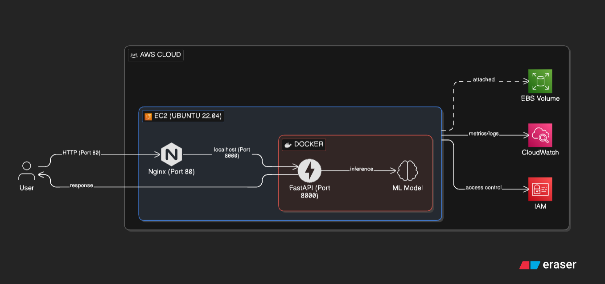
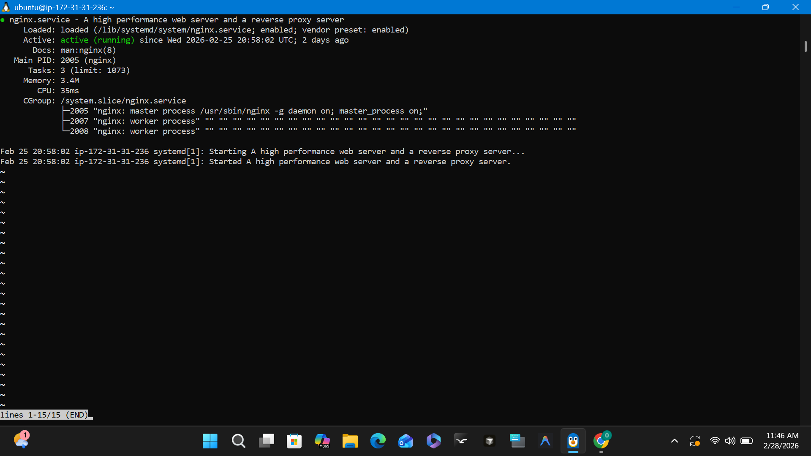

# 🚀 Production ML Inference API on AWS (Docker + Nginx)

Professional-grade deployment of a Machine Learning (ResNet-18) inference service on AWS EC2, featuring containerization with Docker and high-performance request handling via Nginx reverse proxy.

---

## 🏗️ Architecture Overview

This project implements a robust production flow for ML inference. The client communicates with an Nginx reverse proxy, which forwards traffic to a FastAPI application running inside a Docker container. The model serves CIFAR-10 image classifications using PyTorch.

### Infrastructure Flow:
`Client` ➡️ `Nginx (Port 80)` ➡️ `FastAPI (Docker Container: Port 8000)` ➡️ `PyTorch (ResNet-18)`



### Core Components:
- **FastAPI**: Asynchronous Python web framework for low-latency ML serving.
- **PyTorch/TorchVision**: Deep learning framework utilizing a pretrained ResNet-18 architecture fine-tuned for CIFAR-10.
- **Docker**: Ensures consistent environment parity across development and production.
- **Nginx**: Acts as a production-grade reverse proxy, handling buffer management, SSL termination (ready), and security.

---

## 🛠️ Tech Stack

- **Language**: Python 3.10
- **Framework**: FastAPI (Uvicorn)
- **ML Engine**: PyTorch, TorchVision
- **Containerization**: Docker
- **Web Server**: Nginx
- **Infrastructure**: AWS (EC2 Ubuntu 22.04), Terraform
- **Storage**: AWS EBS (GP3)

---

## ☁️ Infrastructure Details

The API is hosted on an **AWS EC2 (Ubuntu 22.04)** instance.

- **Instance Type**: t2.micro (Scale-ready)
- **EBS Volume**: Optimized storage resized to handle Docker image/caching overhead.
- **Security Groups**: 
    - Port 22: SSH Access (Internal/Admin)
    - Port 80: HTTP Traffic (Public - managed by Nginx)
    - Port 443: HTTPS Traffic (Ready for SSL)


---

## 🐳 Docker Setup

The application is fully containerized for portability and scale.

### Build and Run:
```bash
# Build the production image
docker build -t ml-inference-api .

# Run the container in detached mode
docker run -d -p 8000:8000 --name ai-inference ml-inference-api
```


---

## 🔧 Nginx Configuration

Nginx is placed in front of the Docker container to handle traffic efficiently. It forwards requests from port 80 to the internal Docker service on port 8000.

**Why Nginx?** 
- **Security**: Hides backend application details.
- **Performance**: Handles multiple concurrent connections more efficiently than Uvicorn alone.
- **Scalability**: Simplifies future load balancing and SSL (Certbot) integration.

```nginx
server {
    listen 80;
    server_name _;

    location / {
        proxy_pass http://localhost:8000;
        proxy_set_header Host $host;
        proxy_set_header X-Real-IP $remote_addr;
    }
}
```



---

## 🚀 Deployment Steps

1. **Infrastructure Provisioning**: Deploy EC2 instance via Terraform.
2. **Environment Setup**: Install Docker and Nginx on the target Ubuntu server.
3. **Storage Optimization**: Resize EBS volume to accommodate ML models and Docker layers.
4. **Application Deployment**: Clone repository and execute Docker build/run.
5. **Reverse Proxy Configuration**: Configure Nginx and restart the service to point to the FastAPI backend.

---

## 📊 API Documentation (Swagger)

FastAPI provides automatic interactive API documentation available at `/docs`.

**Key Endpoint:** `POST /predict`
- **Input**: Image file (JPG/PNG)
- **Response**: Predicted class, Confidence score, Class index


---

## 🏆 Skills Demonstrated

- **MLOps**: Productionizing ML models with FastAPI and PyTorch.
- **Cloud Engineering**: Provisioning and configuring AWS infrastructure.
- **DevOps**: Containerization with Docker and reverse proxying with Nginx.
- **Security**: Security Group configuration and infrastructure hardening.
- **System Administration**: Managing Linux environments and storage volumes.

---

## 📈 Future Improvements

- [ ] **CI/CD**: Automate deployment via GitHub Actions.
- [ ] **HTTPS**: Integrate Let's Encrypt/Certbot for SSL termination.
- [ ] **Auto-scaling**: Transition to ECS or EKS for horizontal scaling.
- [ ] **Monitoring**: Implement Prometheus and Grafana for real-time inference tracking.

---

*Developed by AkwerigbeO - [Project Github](https://github.com/AkwerigbeO/Cost-Efficient-AI-Inference-API-using-Transfer-Learning-and-AWS)*
